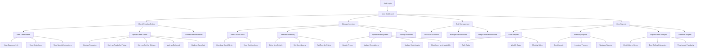

```mermaid
graph TD
    A[Staff Login] --> B[View Dashboard]
    B --> C[Check Pending Orders]
    B --> D[Manage Inventory]
    B --> E[Staff Management]
    B --> F[View Reports]
    
    C --> C1[View Order Details]
    C --> C2[Update Order Status]
    C --> C3[Process Refunds/Issues]
    
    C1 --> C1a[View Customer Info]
    C1 --> C1b[View Order Items]
    C1 --> C1c[View Special Instructions]
    
    C2 --> C2a[Mark as Preparing]
    C2 --> C2b[Mark as Ready for Pickup]
    C2 --> C2c[Mark as Out for Delivery]
    C2 --> C2d[Mark as Delivered]
    C2 --> C2e[Mark as Cancelled]
    
    D --> D1[View Current Stock]
    D --> D2[Add New Inventory]
    D --> D3[Update Existing Items]
    D --> D4[Manage Suppliers]
    
    D1 --> D1a[View Low Stock Alerts]
    D1 --> D1b[View Expiring Items]
    
    D2 --> D2a[Enter Item Details]
    D2 --> D2b[Set Stock Levels]
    D2 --> D2c[Set Reorder Points]
    
    D3 --> D3a[Update Prices]
    D3 --> D3b[Update Descriptions]
    D3 --> D3c[Update Stock Levels]
    D3 --> D3d[Mark Items as Unavailable]
    
    E --> E1[View Staff Schedule]
    E --> E2[Manage Staff Accounts]
    E --> E3[Assign Roles/Permissions]
    
    F --> F1[Sales Reports]
    F --> F2[Inventory Reports]
    F --> F3[Popular Items Analysis]
    F --> F4[Customer Insights]
    
    F1 --> F1a[Daily Sales]
    F1 --> F1b[Weekly Sales]
    F1 --> F1c[Monthly Sales]
    
    F2 --> F2a[Stock Levels]
    F2 --> F2b[Inventory Turnover]
    F2 --> F2c[Wastage Reports]
    
    F3 --> F3a[Most Ordered Items]
    F3 --> F3b[Best Selling Categories]
    F3 --> F3c[Time-based Popularity]
```